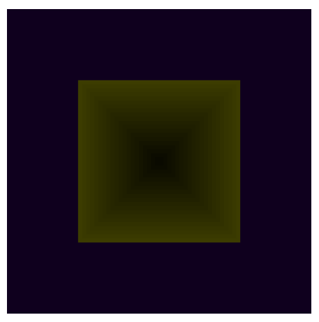
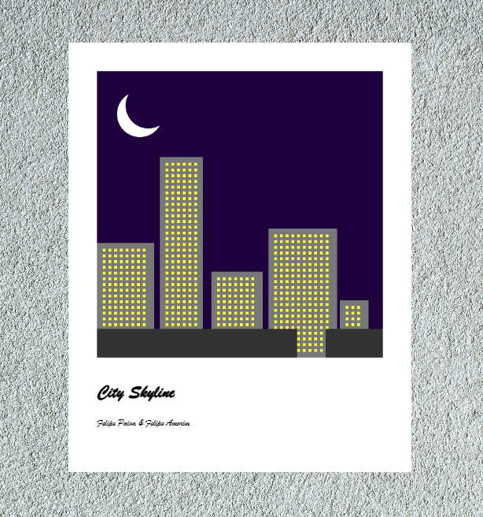
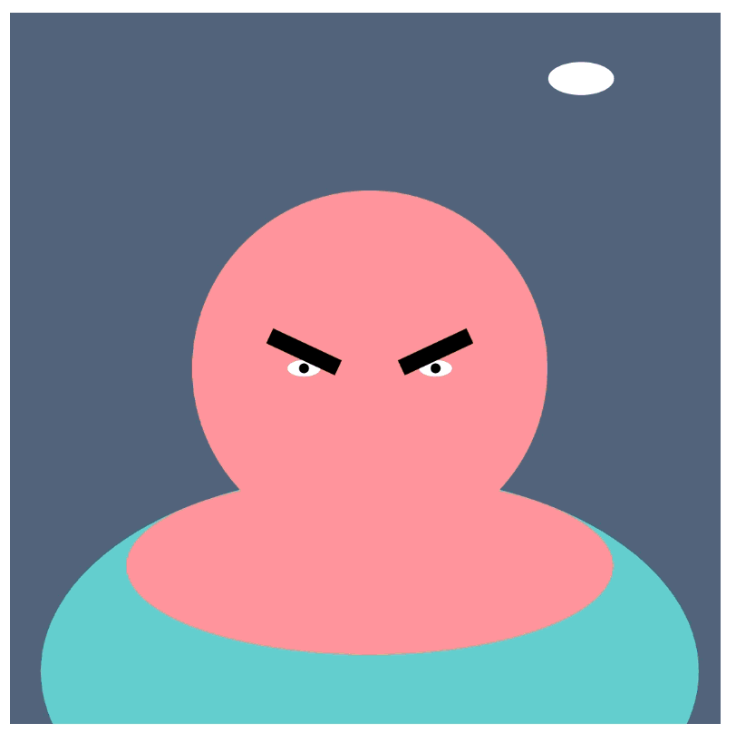
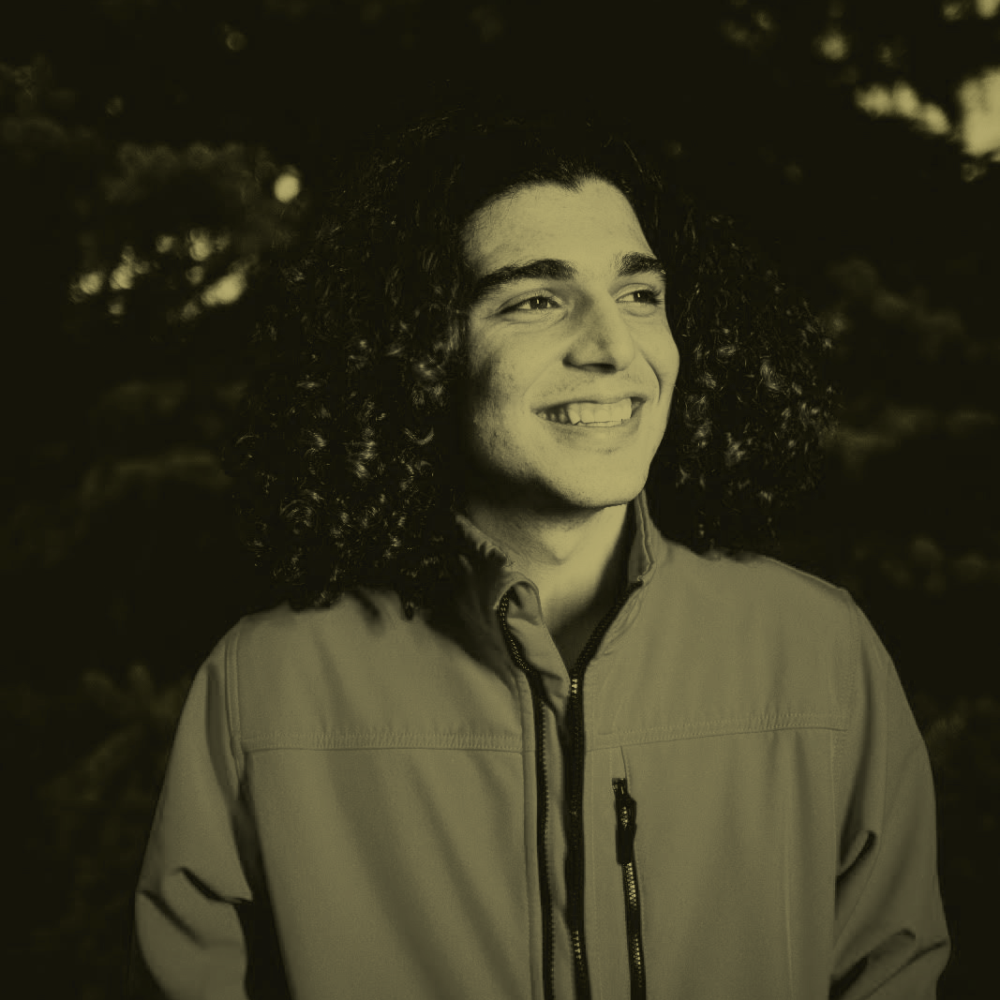

# CART-253

> 

## Felipe A. C. Branco's Repository

This is ``Felipe Amorim Castelo Branco``'s coursework  
repository for CART-253 course at Concordia University.

[View the Github Repository](https://github.com/artCBranco/cart253)

---

## Description

This repository accumulates **all weekly challenges**  
throughout the twelve weeks of classes, as well as  
the larger projects and prototype.

---

## Projects:

### Reflexive Journal

[Read the journal here](https://artcbranco.github.io/cart253/pr/journal)

### Challenges:

- **Hello World**

 [View Online](https://artcbranco.github.io/cart253/pr/challenges/hello-world)

 > 

 [View Code](https://github.com/artCBranco/cart253/pr/challenges/hello-world)

 Teammate for the Hello World Project: [Felipe S. Paiva](https://feguri.github.io/cart253/)

- **Instructions - City Skyline**

 [View Online](https://artcbranco.github.io/cart253/pr/challenges/instructions/city-skyline)

 > 

 [View Code](https://github.com/artCBranco/cart253/pr/challenges/instructions/city-skyline)

 Teammate for the Instructions Project: [Felipe S. Paiva](https://feguri.github.io/cart253/)

- **Variables**

 [View Online](https://artcbranco.github.io/cart253/pr/challenges/variables/mrfurious) 

 > 

 [View Code](https://github.com/artCBranco/cart253/pr/challenges/variables/mrfurious)  

Teammate for the Instructions Project: [Felipe S. Paiva](https://feguri.github.io/cart253/) 
       
       
       
### Prototypes:

- **Instructions**
     
    - **The Emojinaut**
    
     [View Online](https://artcbranco.github.io/cart253/pr/challenges/instructions/emojinaut)
    
     > 
    
     [View Code](https://github.com/artCBranco/cart253/pr/challenges/instructions/emojinaut)
     
     
     
    - **Calm Horizons**
    
     [View Online](https://artcbranco.github.io/cart253/pr/challenges/instructions/calm-horizons)
    
     > 
     
     [View Code](https://github.com/artCBranco/cart253/pr/challenges/instructions/calm-horizons)
     
     
     
     
    - **Charge**
    
     [View Online](https://artcbranco.github.io/cart253/pr/challenges/instructions/charge)
    
     > 
    
     [View Code](https://github.com/artCBranco/cart253/pr/challenges/instructions/charge)

- **Variables**

   - **Let there be... Night!**
     
     [View Online](https://artcbranco.github.io/cart253/pr/challenges/instructions/let-there-be)
       
     > 
       
     [View Code](https://github.com/artCBranco/cart253/pr/challenges/instructions/let-there-be)
       
This is a work in progress
        

---

## About Felipe C. Branco

> 

Felipe C. Branco is a Graphic Designer living  
in Montréal, Canada and currently learning  
Computational Arts at Concordia University. 

While still new to the industry, they are  
brimming with new ideas and a burning  
desire to create.

[Learn more about Felipe](https://artcbranco.carrd.co)

[Portfolio](https://www.behance.net/artcbranco)

---

<small>_Last known alteration made on this file: 2026-09-24_</small>