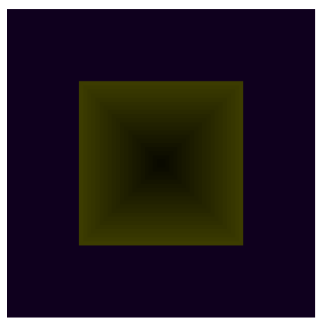
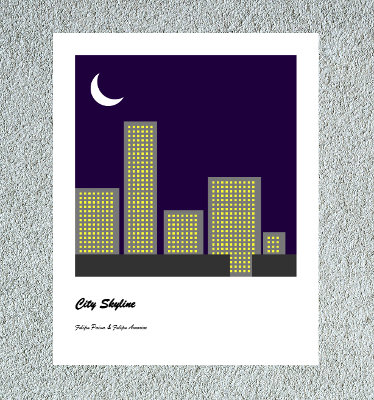
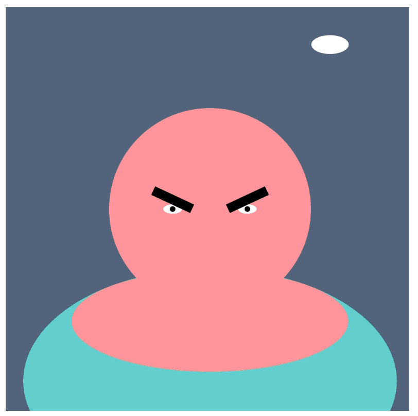
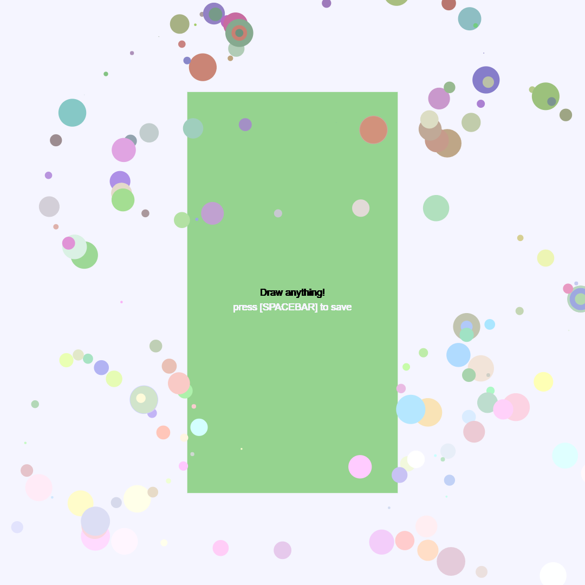
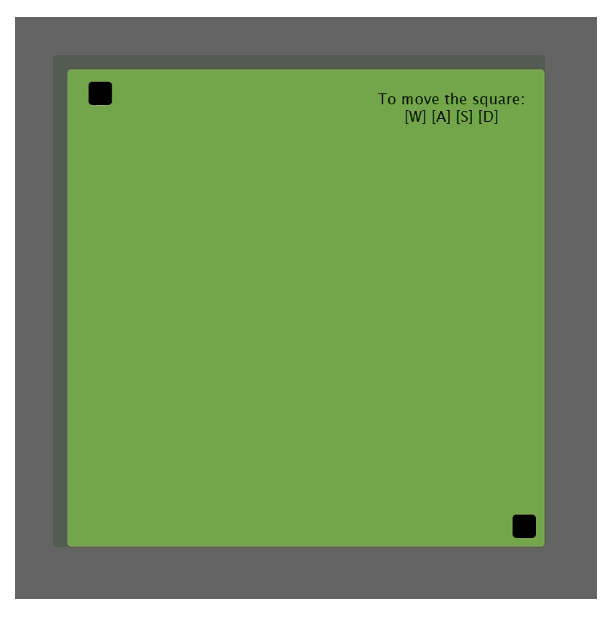

# CART-253

> 

## Felipe A. C. Branco's Repository

This is ``Felipe Amorim Castelo Branco``'s coursework  
repository for CART-253 course at Concordia University.

[View the Github Repository](https://github.com/artCBranco/cart253)

---

## Description

This repository accumulates **all weekly challenges**  
throughout the twelve weeks of classes, as well as  
the larger projects and prototype.

---

## Projects:

### Reflexive Journal

[Read the journal here](https://artcbranco.github.io/cart253/pr/journal)

### Challenges:

- **Hello World**

 [View Online](https://artcbranco.github.io/cart253/pr/w1/hello-world)

 > 

 [View Code](https://github.com/artCBranco/cart253/tree/main/pr/w1/hello-world)

 Teammate for the Hello World Project: [Felipe S. Paiva](https://feguri.github.io/cart253/)

- **Instructions - City Skyline**

 [View Online](https://artcbranco.github.io/cart253/pr/w2/city-skyline)

 > 

 [View Code](https://github.com/artCBranco/cart253/tree/main/pr/w2/city-skyline)

 Teammate for the Instructions Project: [Felipe S. Paiva](https://feguri.github.io/cart253/)

- **Variables - Mr. Furious**

 [View Online](https://artcbranco.github.io/cart253/pr/w2/mrfurious) 

 > 

 [View Code](https://github.com/artCBranco/cart253/tree/main/pr/w2/mrfurious)  

Teammate for the Instructions Project: [Felipe S. Paiva](https://feguri.github.io/cart253/) 

- **Conditionals - Push a Puck**

 [View Online](https://artcbranco.github.io/cart253/pr/w4/push-puck) 

 > 

 [View Code](https://github.com/artCBranco/cart253/tree/main/pr/w4/push-puck)  

Teammate for the Instructions Project: [Felipe S. Paiva](https://feguri.github.io/cart253/) 
       
       
       
       
### Prototypes:

- **Instructions**
     
    - **The Emojinaut**
    
     [View Online](https://artcbranco.github.io/cart253/pr/w2/emojinaut)
    
     > 
    
     [View Code](https://github.com/artCBranco/cart253/tree/main/pr/w2/emojinaut)
     
     
     
    - **Calm Horizons**
    
     [View Online](https://artcbranco.github.io/cart253/pr/w2/calm-horizons)
    
     > 
     
     [View Code](https://github.com/artCBranco/cart253/tree/main/pr/w2/calm-horizons)
     
     
     
     
    - **Charge**
    
     [View Online](https://artcbranco.github.io/cart253/pr/w2/charge)
    
     > 
    
     [View Code](https://github.com/artCBranco/cart253/tree/main/pr/w2/charge)

- **Variables**

   - **Let there be... Night!**
     
     [View Online](https://artcbranco.github.io/cart253/pr/w2/let-there-be)
       
     > 
       
     [View Code](https://github.com/artCBranco/cart253/tree/main/pr/w3/let-there-be)
     
     
     
     
   - **Polka Dot Abstract**
     
     [View Online](https://artcbranco.github.io/cart253/pr/w3/polkadot)
       
     > 
       
     [View Code](https://github.com/artCBranco/cart253/tree/main/pr/w3/polkadot)
       
       
       
       
   - **Gameboy Unadvanced**
     
     [View Online](https://artcbranco.github.io/cart253/pr/w3/gameboy-unadvanced)
       
     > 
       
     [View Code](https://github.com/artCBranco/cart253/tree/main/pr/w3/gameboy-unadvanced)
     
     
        
- **Conditionals**

   - **Prototype 1**
     
     [View Online](https://artcbranco.github.io/cart253/pr/w4/*)
       
     > 
       
     [View Code](https://github.com/artCBranco/cart253/tree/main/pr/w4/*)
     
     
     
     
   - **Prototype 2**
     
     [View Online](https://artcbranco.github.io/cart253/pr/w4/*)
       
     > 
       
     [View Code](https://github.com/artCBranco/cart253/tree/main/pr/w4/*)
       
       
       
       
   - **Prototype 3**
     
     [View Online](https://artcbranco.github.io/cart253/pr/w4/*)
       
     > 
       
     [View Code](https://github.com/artCBranco/cart253/tree/main/pr/w4/*)

---

## About Felipe C. Branco

> 

Felipe C. Branco is a Graphic Designer living  
in Montréal, Canada and currently learning  
Computational Arts at Concordia University. 

While still new to the industry, they are  
brimming with new ideas and a burning  
desire to create.

[Learn more about Felipe](https://artcbranco.carrd.co)

[Portfolio](https://www.behance.net/artcbranco)

---

<small>_Last known alteration made on this file: 2026-09-27_</small>