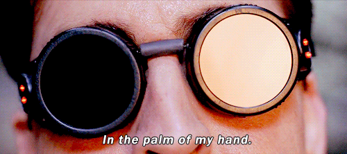

# Reflective Journal

by <striking>Felipe Amorim Castelo Branco</striking>

---

## *Date: 2026-09-11*

Learning to code (even if just with markdown) has been both a huge headache and an extraordinary experience.

On one hand, ever since I typed github on the browser, I have been feeling **very** out of depth. I have had many small exposures to coding in my life from my father that was a programmer (then architect and nowadays IT manager focusing in Cybersecurity) and more recently, from my work as a LQA tester in the game industry, where I can sometimes spy the macros used such as ```</striking>``` and ```</br>``` and the occasional ```{$number}``` and concatenated strings. 

That said, I have never even tried to learn *how* to code or why these macros appeared in the way they did. It's very daunting to face something seemingly so large and endless: A thousand coding languages, incountable details that are a 'must-know' for programmers. It's no wonder that people call it coding _languages_, rather than dialects or even "skills". Because this *is* a language, a very complex one that you have to completely change the way you think if you want to get anywhere at it. 

<sub>Luckily... I debug for a living ;P</sub>

Now, on the **other** hand, I can already taste the freedom on my fingers every time I type "</>" push commits to github. As a Graphic Designer, I _loved_ UI/UX for the ability to do and animate anything I wanted, to really bring a project to life with Figma Prototypes. But I _hated_ it for the fact that all I could ever do was non-functional **prototypes**. 

Unlike printed media, where I knew exactly how to setup the document and export the pdf to print it myself and cut the pages of a magazine with my own hands and put everything together in a final product, UI/UX presented me a huge barrier between my visually pleasing projects and functional websites that I inevitably could only cross by handing off all my things to a stranger and hope they do it correctly.

Now, I have the <striking>power of the sun...</striking> 

> 

<sub>...as long as I can learn to control it.</sub> 

Anyway, my deepest apologies for the prose. TL;DR: I'm very excited to learn coding. It's hard, but surprisingly fun. Even the debugging *("It's broken. Why is it broken? Ah, there it is.")* is a fun experience to me. I'm mostly at the "Monkey see, monkey do" trying out all the code I saw in the Hello World file, like the ```let``` functions, but I'll get there eventually. Of that, I have no doubt. 
